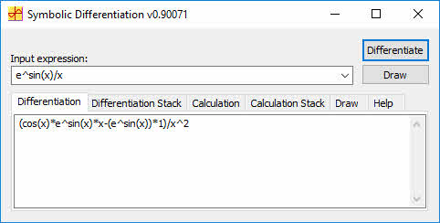
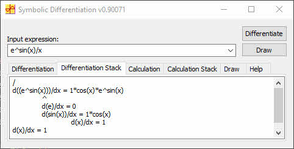
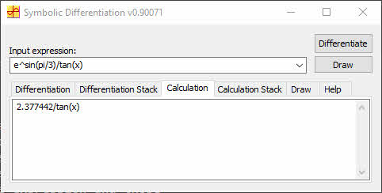
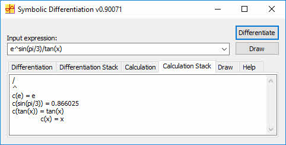
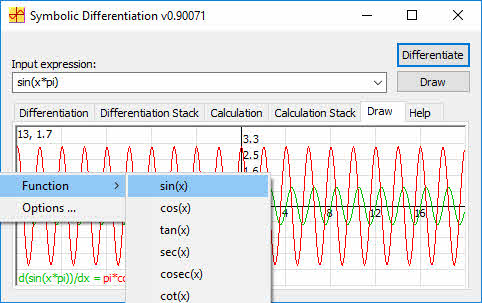
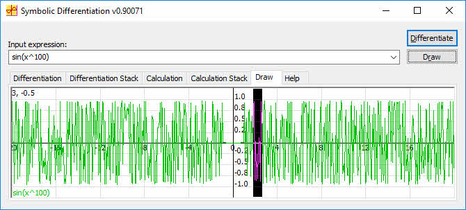
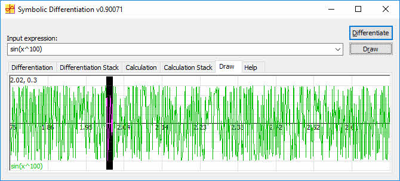


**Differentiation Formulas**

| **Serial** | **Expression** | **Derivative**                      | **Remarks**                           |
|------------|----------------|-------------------------------------|---------------------------------------|
|            | u+v            | du/dx+dv/dx                         |                                       |
|            | u-v            | du/dx-dv/dx                         |                                       |
|            | u/v            | (v\*du/dx-u\*dv/dx)/v^2             |                                       |
|            | u\*v           | u\*dv/dx+v\*du/dx                   |                                       |
|            | c\*u           | c\*du/dx                            | c is constant                         |
|            | u^v            | v\*u^(v-1)\*du/dx+u^v\*ln(u)\*dv/dx |                                       |
|            | u^n            | n\*u^(n-1)\*du/dx                   | n is real                             |
|            | c^u            | c^u\*ln(c)\*du/dx                   | c is constant                         |
|            | e^u            | e^u\*du/dx                          | e = 2.7182818284590452353602874713527 |
| 1          | sin(u)         | cos(u)\*du/dx                       |                                       |
| 2          | cos(u)         | -sin(u)\*du/dx                      |                                       |
| 3          | tan(u)         | sec(u)^2\*du/dx                     |                                       |
| 4          | sec(u)         | sec(u)\*tan(u)\*du/dx               |                                       |
| 5          | cosec(u)       | -cosec(u)\*cot(u)\*du/dx            |                                       |
| 6          | cot(u)         | -cosec(u)^2\*du/dx                  |                                       |
| 7          | sinh(u)        | cosh(u)\*du/dx                      |                                       |
| 8          | cosh(u)        | sinh(u)\*du/dx                      |                                       |
| 9          | tanh(u)        | sech(u)^2\*du/dx                    |                                       |
| 10         | sech(u)        | sech(u)\*tanh(u)\*du/dx             |                                       |
| 11         | cosech(u)      | cosech(u)\*coth(u)\*du/dx           |                                       |
| 12         | coth(u)        | -cosech(u)^2\*du/dx                 |                                       |
| 13         | asin(u)        | 1/sqrt(1-u^2)\*du/dx                |                                       |
| 14         | acos(u)        | -1/sqrt(1-u^2)\*du/dx               |                                       |
| 15         | atan(u)        | 1/(1+u^2)\*du/dx                    |                                       |
| 16         | asec(u)        | 1/(|u|\*sqrt(u^2-1))\*du/dx         | |u| is abs(u)                         |
| 17         | acosec(u)      | -1/(|u|\*sqrt(u^2-1))\*du/dx        | |u| is abs(u)                         |
| 18         | acot(u)        | -1/(1+u^2)\*du/dx                   |                                       |
| 19         | asinh(u)       | 1/sqrt(u^2+1)\*du/dx                |                                       |
| 20         | acosh(u)       | 1/sqrt(u^2-1)\*du/dx                |                                       |
| 21         | atanh(u)       | 1/(1-u^2)\*du/dx                    |                                       |
| 22         | asech(u)       | -1/(u\*sqrt(1-u^2))\*du/dx          |                                       |
| 23         | acosech(u)     | -1/(u\*sqrt(1+u^2))\*du/dx          |                                       |
| 24         | acoth(u)       | 1/(1-u^2)\*du/dx                    |                                       |
| 25         | sqrt(u)        | 1/(2\*sqrt(u))\*du/dx               |                                       |
| 26         | log10(u)       | 1/(u\*ln(10))\*du/dx                |                                       |
| 27         | log(u)         | 1/u\*du/dx                          |                                       |
| 28         | ln(u)          | 1/u\*du/dx                          |                                       |
| 29         | sign(u)        | 0                                   |                                       |
| 30         | abs(u)         | u/|u|\*du/dx                        | |u| is abs(u)                         |

Mathematical Expression
-----------------------

A mathematical expression includes numbers, operators, functions,
variables and operators. Operators include +, -, \*, / and ^. Functions
are like sin(x) and variables are like x. Our target here is to identify
each element and to get the right differentiation rule applied to that
element or a group of elements.

**Expression examples**:

sin(2\*x)/x

sin(45+cos(2)/tan(x)

sign(cos(x)

32\*9-8/2

Differentiation Steps{#steps}
---------------------

### Expression Parsing to Fill Stack

Expression parsing is the process of scanning an expression to find its
elements (numbers, operators, functions and variables). Each operator
should have two operands; for example, take 2\*12. The operator "\*" has
two operands: 2 and 12. Each function has its argument. For example,
for sin(x), the function is sin and the argument is x. So, we should
scan the expression in a specific way to identify each operator and the
operands, as well as each function argument, to simplify the calculation
or the differentiation.

Expression execution depends on [operator precedence](#precedence).
If we can construct a stack of operators and operands such that each
operator is followed by its two operands, 2\*12 should construct this
stack: "\*, "2", "12". So, the calculation function checks the stack. If
the item is an operator, then it takes its two operands and does the
calculation for them in a recursion formula, so the whole expression can
be calculated. For example, the expression:

    sin(2\*12)/7+9^2

...should be calculated in these steps:

1.  Calculate sin(2\*12)/7

2.  Calculate 9^2

3.  Then apply the operator + for the two results

4.  To calculate point 1, we need to:

    1.  Calculate sin(2\*12)

    2.  Calculate 7

    3.  Then divide the two results

    4.  To calculate point 4.1, we need to:

        1.  Calculate 2\*12

        2.  Apply the sin function to the result

        3.  To calculate point 4.4.1, we need to:

            1.  Apply the operator \* to the two operands 2 and 12

It is obvious now that it is a recursion operation. To do that, we need
to formulate the expression in a stack of operators and operands, and
process that stack in a certain way to get the final result. The main
steps to do that in brief are:

-   Find operators

-   Split the expression at the operator index

-   Add the two resultant operands to the stack

-   If operators are not found, then check if the expression starts with
    a function name

If we apply the previous steps, we will have the stack in this form:

| +          |
|------------|
| /          |
| sin(2\*12) |
| 7          |
| ^          |
| 9          |
| 2          |

The mathematical expression parsing is as follows:

-   Insert the first input into the stack

-   Loop in the expression stack to check if any expression can be
    divided into two queries

-   Check if the expression item is an operator (+-\*/^)

-   Parse the expression to find the operators

-   If an operator is found:

    -   Split the expression into two queries at the operator index

    -   Add the left operand of the operator as a new expression

    -   Add the right operand of the operator as a new expression

-   Else

    -   Check if the expression string starts with a function or a
        parenthesis

    -   If a function is found, set its number in the expression data

### Apply Differentiation Formulas on the Stack

Applying differentiation formulas means to iterate the stack, take each
operator and apply the differentiation rule - depending on the operator
- on the two operands of the operator:

| **Expression** | **Derivative**          |
|----------------|-------------------------|
| u+v            | du/dx+dv/dx             |
| u-v            | du/dx-dv/dx             |
| u/v            | (v\*du/dx-u\*dv/dx)/v^2 |
| u\*v           | u\*dv/dx+v\*du/dx       |
| c\*u           | c\*du/dx                |
| u^n            | n\*u^(n-1)\*du/dx       |
| c^u            | c^u\*ln(c)\*du/dx       |
| e^u            | e^u\*du/dx              |

If any operand is an operator, then the function is called again in a
recursive way to differentiate the whole expression. The following code
represents this function:

## **Optimize Equation**

Optimizing the equation includes these simple steps:

-   Replace "--" with "" or "+"

-   Replace "+-" with "-"

-   Replace "((....))" with "(....)"

-   Remove any "1\*"

-   Remove any "\*1"

-   Remove any "^1"

-   Remove any "1\*"

-   Remove unneeded parentheses

Differentiation **Pseudo Code**
-------------------------------

    Differentiate(input)
    
    {
    
    Stack = FillStack(input)
    
    output = DifferentiateStack(Stack)
    
    Optimize(output)
    
    return output
    
    }
    
    FillStack(input)
    
    {
    
    operators\[\] { "+-", "\*/", "^%" }
    
    stack.push(input)
    
    loop( n = 1 to stack.size() )
    
    {
    
    if stack\[n\] is not operator
    
    if GetOperator(stack\[n\], operators) success
    
    {
    
    Split stack\[n\]
    
    stack.Insrt(left operand)
    
    stack.Insrt(right operand)
    
    }
    
    else
    
    GetFunction(stack\[n\])
    
    }
    
    }
    
    DifferentiateStack(stack, index)
    
    {
    
    if stack\[index\] is operator
    
    {
    
    index++
    
    u = stack\[index\]
    
    du = DifferentiateStack(stack, index)
    
    v = stack\[index\]
    
    dv = DifferentiateStack(stack, index)
    
    if operator = '-' or '+'
    
    output = du+operator+dv
    
    else if operator = '\*'
    
    output = u\*dv+du\*v
    
    else if operator = '/'
    
    output = (du\*v-u\*dv)/v^2
    
    else if operator = '^'
    
    output = v\*u^(v-1)\*du+u^v\*ln(u)\*dv
    
    }
    
    else
    
    output = stack\[index++\].GetDifferentiation()
    
    return output
    
    }
    
    void Optimize(str)
    
    {
    
    replace "--" with "" or "+"
    
    replace "+-" with "-"
    
    replace "((....))" with "(....)"
    
    remove any 1\*
    
    remove any \*1
    
    remove any exponent equal 1
    
    remove unneeded parentheses
    
    if str changed then
    
    Optimize(str)
    
    }
    
    ExpressionItem::GetDifferentiation()
    
    {
    
    if Function then
    
    {
    
    arument = Argument(input);
    
    if function = SIN
    
    output = Differentiate(arument)\*cos(arument)
    
    else if function = COS
    
    output = Differentiate(arument)\*(-sin(arument))
    
    else
    
    ...
    
    }
    
    }
    
    else
    
    {
    
    if input = "x"
    
    output = "1"
    
    else if input = "-x"
    
    output = "-1"
    
    else if input is numeric
    
    output = "0"
    
    else
    
    output = "d"+input+"/dx"
    
    }
    
    }

The Differentiation tab displays the differentiation results after
applying the [differentiation
steps](#steps) in
the input expression. The input expression is calculated before
differentiation to optimize any arithmetic part that includes numbers as
in the example:

e^sin(pi/3)/tan(x) is optimized to 2.377442/tan(x) before
differentiation to get the result (-2.377442\*sec(x)^2)/(tan(x))^2.

### Differentiation Stack

### Calculation

This tab is a Symbolic Calculator that can calculate any
mathematical expression, however complicated. The calculation includes
only two constants:

    e = 2.7182818284590452353602874713527
    
    pi = 3.1415926535897932384626433832795

### Calculation Stack

This view is used to view the stack of the calculation details. This 
means "the calculation of." The stack contents are arranged from top
to bottom. Calculation steps are differentiation steps, except the
operators' formulas. The advantage of this view is that it enables
showing of the parts that can be calculated in the expression and those
that can't be calculated, as in the example in the figure.

### Draw

This tab is used to view the input function curve and its
differentiation curve. You can view the input function curve only by
clicking "Draw." The view includes horizontal and vertical axes, as well
as grid lines. You move over any point in the view to see its
coordinates in the left upper corner, and you can zoom in on any part by
selecting it with the mouse. **The horizontal and vertical axes' limits
update automatically to include the input function points in the view**.
You can change these limits by right clicking the view.

Points of Interest
------------------

1.  **Part of Expression Calculation**

The advantage of my expression parsing over other parsers on the net is
that it can calculate part of the expression and leave the other part,
and that includes any variables. For example, take the
expression sin(45+sin(2))/tan(x). If you try to input this expression to
any free parser on the net, it will give an error indicating an invalid
character x. However, my parser gives you 0.937227/tan(x). For any
complex expression, my parser tries to optimize the expression before
the differentiation, and calculates any part that can be calculated. So,
the differentiation of sin(45+sin(2))/tan(x) is (-0.937227\*sec(x)^2)/(tan(x))^2.

1.  **Operator Precedence**{#precedence}

When a complex expression has multiple operators, the operator
precedence determines the sequence in which the operations are
performed. The order of execution can significantly affect the resulting
value. Operators have these precedence levels. An operator on higher
levels is evaluated before an operator on a lower level:

-   "+" (Positive), - (Negative)

-   ^ (Exponent), % (Modulo)

-   \* (Multiply), / (Division)

-   + (Add), - (Subtract)

When two operators in an expression have the same operator precedence
level, they are evaluated left to right based on their position in the
expression. For example, in 4 - 2 + 27, the subtraction operator is
evaluated before the addition operator to get 2 + 27, which yields an
expression result of 29.

Use parentheses to override the defined precedence of the operators in
an expression. Everything within the parentheses is evaluated first to
yield a single value before that value can be used by any operator
outside of the parentheses. For example, 2 \* 4 + 5 evaluates to 8 + 5,
which yields an expression result of 13. The expression 2 \* (4 +
5) evaluates to 2 \* 9; the parentheses cause the addition to be
performed first and so the expression result is 18.

If an expression has nested parentheses, the most deeply nested
expression is evaluated first. The example 2 \* (4 + (5 - 3) ) contains
nested parentheses, with the expression 5 - 3 in the most deeply nested
set of parentheses. This expression yields a value of 2. Then the
addition operator (+) adds this result to 4, which yields a value of 6.
Finally, the 6 is multiplied by 2 to yield an expression result of 12.

1.  **Zoom In**

In the drawing area, you can select any area to zoom in on. For example,
the function sin(100\*x) has a very large variation, as in the following
figure:

By zooming in many times, we can view the smaller details, as in the
following figures:

**Note:** Check the horizontal axis resolution after each zoom-in.

